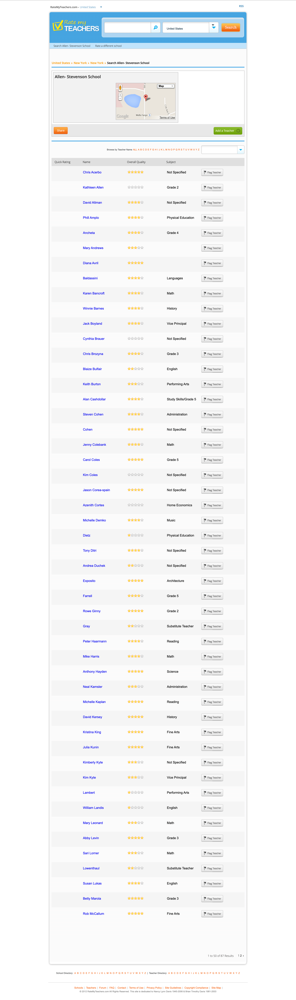

# RateMyTeachers

Archive of the Reactor project, the ground-up rewrite of [RateMyTeachers.com](https://web.archive.org/web/20130314062423/http://www.ratemyteachers.com/) (archived website), circa 2011–2013.

This is the archived source, published as-is.

## About

**This repo was the core engine behind RateMyTeachers.com, rewritten from scratch in PHP on the CodeIgniter framework.**

RateMyTeachers was a site where students and parents rated/reviewed their teachers and schools. 

**By the time this rewrite was underway, the website was doing _well over_ 100,000+ unique visitors a day.** Which was just an incredible amount of traffic back then.

The original website, was glued together with shoe strings and bubblegum, and then bundled with bubble wrap and finally sealed with duct tape.

There was no PHP framework. It was just cowboy-ed PHP files, HTML, and CSS. 

In terms of server architecture...we didn't really have any:

- Two web servers
- One mySQL server
- One load balancer

That was it.

It wasn't uncommon for the site to go down 2-3x per week.

## My role

I was tasked with taking the whole mess, stabilizing it, scaling it, and, most importantly, _creating a reusable web framework so we could quickly deploy into other rating website verticals._

**I was also 19, maybe 20 years old, wrapping up my bachelor's and about to start grad school.**

So naturally, I decided to rewrite the entire site by myself.

_(I'd been programming since I was 13, so in my head, this felt completely reasonable.)_

This repository is that rewrite. I named the repo "Reactor," not "RateMyTeachers," on purpose. The goal was a reusable rating engine that RateMyTeachers just happened to be the first tenant of.

I'm publishing it because it's a solid artifact of what a young, self-taught developer's idea of "doing it right" looked like in 2012, on a real site with real traffic, with nobody senior reviewing the code.

And, even more telling, is the fact that I was already including machine learning components into the project (namely for fake teacher/school rating detection).

Honestly, I'm pretty proud of this project. It certainly wouldn't stand today's level of standards or scrutiny, but for a 19-20 year old, it was extremely special.

**Before you read the code:** This is CodeIgniter 2.0.2 on PHP 5.3, developed under MAMP. It will _not_ run as-is. Additionally, every credential, key, and secret has been scrubbed or replaced with a placeholder, so nothing here connects to anything until you fill it in yourself. Passwords in the users table were stored in plaintext, which was common then and is indefensible now. This as a period piece, not a starter template.

## Why it's built the way it is

Here's a bit more context as to why I architected the platform the way I did.

### 1. This an _engine_, not a site

Almost nothing about "teachers" or "schools" is hardcoded.

Table names, column names, class names, constants, validation rules, and the numerical rating fields all live in config ([`application/config/site.php`](application/config/site.php) and [`core.php`](application/config/core.php)). The domain objects read their schema from there at runtime, and objects are even instantiated through a config-driven class map instead of direct `new` calls.

The idea was that you could point Reactor at a different rating site (rate my professor, rate my mechanic, rate my anything) and reconfigure it instead of rewriting it.

**Yes, that's over-engineered for a site that only ever had one tenant.** But the instinct, separating the engine from the data it happens to hold, was the right decision back then.

### 2. Using raw SQL rather than CodeIgniter's ActiveRecord ORM

There are no CodeIgniter models here. The [`models/`](application/models/) folder is _purposely_ empty.

CodeIgniter's Active Record (its ORM) built queries that were slower and more bloated than the ones I could write by hand. 

At 100,000+ uniques a day, a slow query holds a database connection open longer, and enough held-open connections can cause a site to crash (_especially_ back then).

**I learned that the hard way, in production. I couldn't rely on CodeIgniter's ORM. I had to engineer my own.**

The data layer is hand-written, index-tuned SQL wrapped in a small object model: domain objects ([`Organization`](application/modules/core/libraries/organization.php), [`Person`](application/modules/core/libraries/person.php), [`Rating`](application/modules/core/libraries/rating.php), [`Rebuttal`](application/modules/core/libraries/rebuttal.php)) built by dedicated [`Builder`](application/modules/core/libraries/rateablebuilder.php) classes, narrowed by [`Filter`](application/modules/core/libraries/filter.php) classes, and rendered into links by [`URL`](application/modules/core/libraries/url.php) classes.

Once we relaunched RateMyTeachers using this framework we _very rarely_ experienced downtime. The system was scalable.

### 3. Building and caching offline

Browse-by-letter navigation, XML sitemaps, and internal KPIs are all generated ahead of time by separate batch jobs (some of them written in Java) that run on a schedule. The runtime modules just serve the precomputed result.

The reasoning here was the raw SQL: 

Keep request time cheap, and push the heavy lifting somewhere the user isn't waiting on it.

### SEO-shaped throughout

RateMyTeachers lived and died by organic search, so the whole thing is built for crawlers as much (if not _more_) as for people.

URLs are clean and human-readable, with a slug and a typed suffix (`some-school-name/12345-o` for an organization, `-p` for a person, `-r` for a rating, `.rss` for a feed).

Ending the URL in the format `{integer}-{identifer}` allowed me to quickly run regex expressions and then route them to the correct controller.

_**Note:** That doesn't seem like a big deal, but the old version of RateMyTeachers was so insanely slow and buggy that poorly written URL rewrites in the [`.htaccess`](.htaccess) file would often cause the site to crash under heavy load._

There's a also a sitemap generator, an RSS layer, and drilldown pages that hand crawlers a path to every organization and person on the site.

## How the code is organized

Reactor uses HMVC (Modular Extensions), so each feature is a self-contained module with its own controllers, libraries, views, and config under [`application/modules/`](application/modules/). 

Picking HMVC on top of CodeIgniter 2 was not the default choice, and most CI developers never touched it. I needed to such that we could organize the code and scale it.

The modules fall into four groups.

**1. The engine:**

- **[`core`](application/modules/core/):** The heart of everything. The [`Rateable`](application/modules/core/libraries/rateable.php) base class and its four tiers ([`Organization`](application/modules/core/libraries/organization.php), [`Person`](application/modules/core/libraries/person.php), [`Rating`](application/modules/core/libraries/rating.php), and the optional [`Rebuttal`](application/modules/core/libraries/rebuttal.php)), plus every [`Builder`](application/modules/core/libraries/rateablebuilder.php), [`Filter`](application/modules/core/libraries/filter.php), [`FilterParser`](application/modules/core/libraries/filterparser.php), [`Adder`](application/modules/core/libraries/adder.php), [`URL`](application/modules/core/libraries/url.php), [`Stats`](application/modules/core/libraries/stats.php), and [`Sync`](application/modules/core/libraries/sync.php) class that operates on them. Sessions, users, pagination, and department lookups live here too. Every other module is built on this one.

**2. Runtime feature modules** (serve live requests)

- **[`drilldown`](application/modules/drilldown/):** Browse-by-letter navigation for organizations and persons, reading the precomputed "drillbit" files produced by [`drilldown_generator`](application/modules/drilldown_generator/). This is what let a visitor (or a crawler) page through every entity on the site.
- **[`rss_feeds`](application/modules/rss_feeds/):** Generates RSS/XML feeds for the homepage, for a single organization, and for a single person.
- **[`activity_feeds`](application/modules/activity_feeds/):** The underlying "recent activity" data (new ratings and reviews) for an organization or person that the feeds are built from.
- **[`sitemap`](application/modules/sitemap/):** The runtime `location` browse page that lists states and cities.
- **[`blog`](application/modules/blog/):** A small blog (latest post, and a post by id) for content and SEO.
- **[`recently_searched`](application/modules/recently_searched/):** Tracks and resurfaces the organizations and persons people searched for most recently.
- **[`nearby_organizations`](application/modules/nearby_organizations/):** Finds organizations geographically near a given one.
- **[`contact_importer`](application/modules/contact_importer/):** The "refer a friend" loop. Pulls a new user's contacts from the major webmail providers (via the bundled OpenInviter library) and sends invites. This is the one module that's mostly third-party code.

**3. Offline generators** (batch jobs, run on a schedule)

- **[`drilldown_generator`](application/modules/drilldown_generator/):** Mines the database and precomputes the drilldown trees ("drillbits") for states, cities, organizations, and persons. Part PHP, part Java (a small [`Miner`](application/modules/drilldown_generator/java/src/Miner.java)/[`Driller`](application/modules/drilldown_generator/java/src/Driller.java) pipeline), driven by shell scripts.
- **[`sitemap_generator`](application/modules/sitemap_generator/):** Dumps the database and generates the XML sitemaps that search engines crawl. Also part PHP, part Java.
- **[`kpi_generator`](application/modules/kpi_generator/):** Computes internal KPIs (traffic, ratings added, search volume) for reporting.

**4. Maintenance and moderation** (cron cleanup and machine learning)

- **[`numerical_only_remover`](application/modules/numerical_only_remover/):** A cleanup queue that finds and removes junk ratings whose comment is nothing but numbers.
- **[`pending_review_remover`](application/modules/pending_review_remover/):** A cleanup queue that clears out ratings stuck in the pending-review moderation state. _(Both remover queues are built on a shared abstract [`Queue`](application/modules/pending_review_remover/libraries/queue.php).)_
- **[`automod`](application/modules/automod/):** A separate Java component, codenamed "charlie," that uses Weka to train an n-gram text classifier on labeled rating comments, then auto-moderates new comments by flagging the abusive and spammy ones. **A machine-learning content moderator, hand-built in 2012. _Clearly_ I knew where I was going in life.**

## Stack

- PHP 5.3, CodeIgniter 2.0.2, with Modular Extensions (HMVC)
- MySQL, hand-written SQL (no ORM), developed under MAMP
- Java and Weka for the auto-moderation classifier and the offline generators
- OpenInviter for the contact-import / refer-a-friend flow
- Doxygen for the code docs (see [`generate_docs.sh`](generate_docs.sh) and the [`.doxy`](reactor_core.doxy) config)

## Status

Archived and unmaintained, published for historical interest.

This project won't run out of the box (obviously), and the stack is well over a decade out of date. Credentials and keys have been removed, and the real user data has been stripped (see below). I have no plans to revive it.

## What was removed for this release

This is a scrubbed copy of the original working tree, not the raw thing. To publish it responsibly, I took out:

- **Every credential and key:** The database logins, the CodeIgniter encryption key, and a third-party API key, all replaced with empty placeholders
- **The [`automod`](application/modules/automod/) training data:** Roughly 19,000 real teacher reviews the classifier learned from, plus the trained model and its feature files.
- **The drilldown data dumps:** Precomputed navigation files that listed real teacher and school names
- **The generated API docs and the macOS `.DS_Store` clutter**

## Ownership and provenance

I wrote this as an employee of RateMyTeachers. I spent roughly six years with the company, not as a contractor and not on my own time. Under standard work-for-hire, that means the code belonged to the company, not to me.

RateMyTeachers was acquired a long time ago. The acquirer ran RateMyTeachers alongside another property (a rehab-referral site, if I remember right, but has since shut down), _and as far as I can tell, nobody runs this codebase anymore._

I'm publishing this repo in good faith, as a historical archive, and not as anything I claim to own. **If you hold rights to this code and would rather it not be here, reach out and I'll take it down.**

That also means there's no open-source license on this one. The code isn't mine to relicense.

## A note on the author, circa 2012

I was 19 or 20 when I wrote this.

Some choices make me wince now (plaintext passwords, over-engineered config abstraction). Some of it I'm genuinely proud of (the raw-SQL performance calls, the offline/runtime split, a working ML moderator in Java).

**Mostly it's the code of someone who was in over his head and decided the way out was to build something more ambitious than he strictly needed to.**

That's still pretty much how I operate.

And, despite being only 19 or 20 when I put this project together (and still going through school at the same time), I'm proud of how it turned out.

Not many teenagers get to say they hand-coded, from scratch, a platform that was responsible for generating millions of dollars in revenue.

I did that.

And, given the era, the code was pretty great too.

## Screenshots

